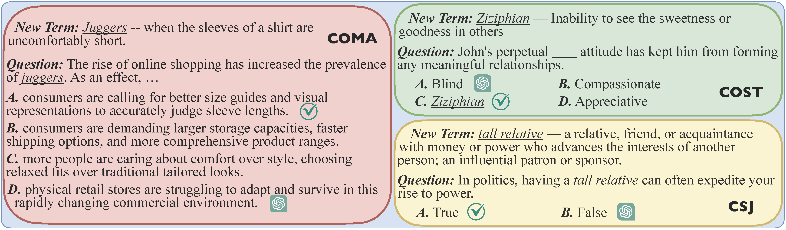
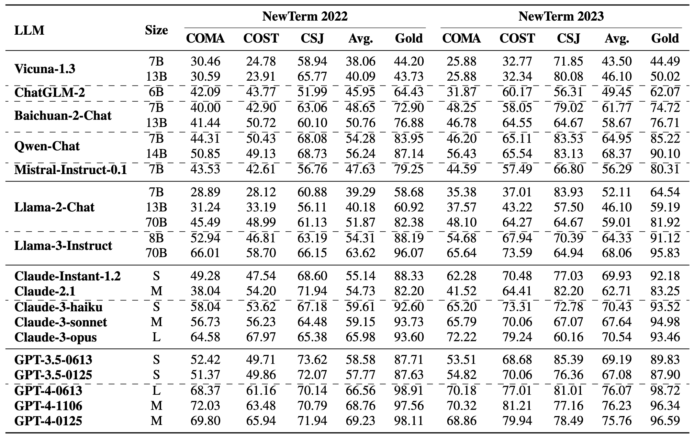
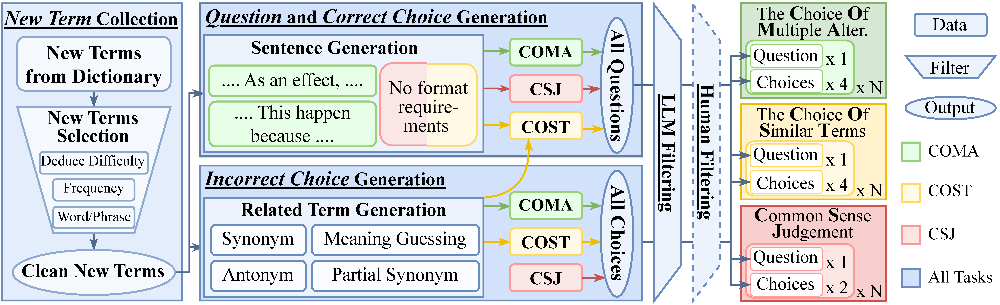
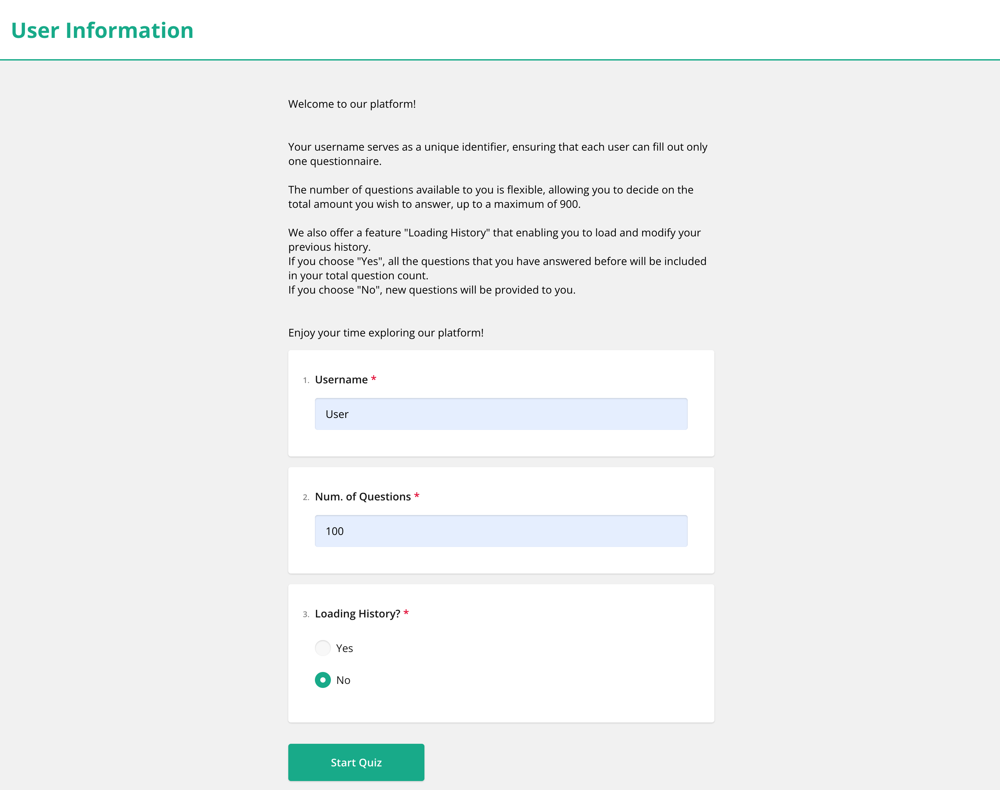
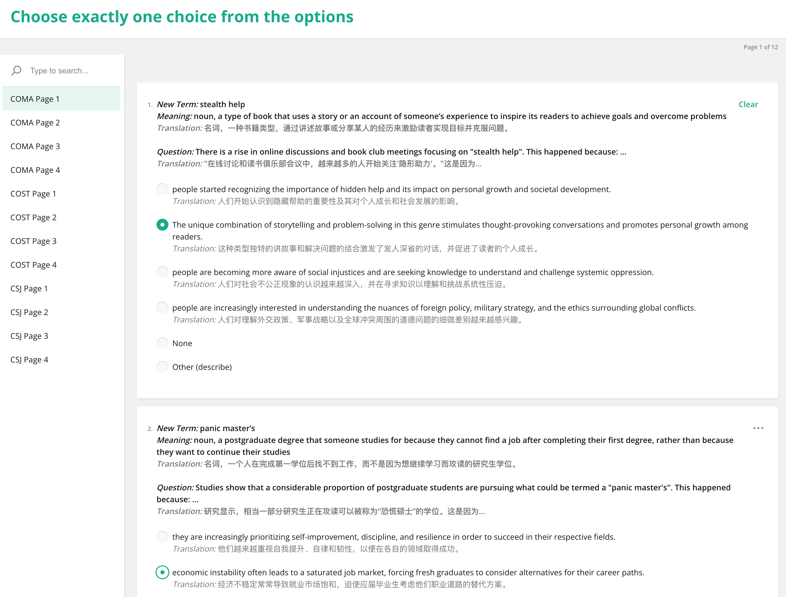

# NewTerm++: Evaluating and Improving LLMs on Real-Time New Terms

:star: **NewTerm 2024 and Multilingual 2024 have been updated!** These datasets now cover new terms from **April 2024** to **March 2025**.
* **NewTerm 2024**: Covers English only.
* **Multilingual 2024**: Covers German, French, Italian, Spanish, Portuguese, Russian, Chinese, Japanese, Korean, and Catalan.

This repository hosts the the code and benchmark for the paper "***NewTerm**: Benchmarking Real-Time New Terms for Large Language Models*" and "***NewTerm++**: Evaluating and Improving Large Language Models on Real-Time New Terms*". Our work not only evaluates the performance of LLMs on real-time new terms but also provides tools for enhancing their capabilities.

We've developed a highly automated pipeline for new term benchmarks, which requires minimal human intervention, ensuring high-quality and flexible updates for real-time information. Further, we construct **NewTerm 2022** and **NewTerm 2023**, focusing on new words, new phrases, and old words with new meanings, and will **continue updating annually**. Additionally, we introduce an **enhancement framework** leveraging synthetic data generation and instruction tuning to improve LLMs on these challenging terms.

You can use ***NewTerm*** to:

- Assess the performance of existing LLMs using real-time new terms sourced from dictionaries.
- Enhance LLMs by fine-tuning them with contextual examples of new terms.
- Build your custom benchmark, targeting specific terms such as new annual terms, low-frequency words, low-resource languages, and literary or religious texts.
- Use an interactive human filtering interface to create a higher-quality benchmark. This user-friendly interface requires human annotators to answer multiple-choice questions, making it suitable for crowdsourced annotators.

Our benchmark includes three open-domain NLU tasks. The cases for these tasks are illustrated as follows:




## Large Language Models (LLMs) Evaluation

We evaluate LLMs using our generated benchmarks, **NewTerm 2022** and **NewTerm 2023**, located in the [benchmark\_2022](benchmark_2022/) and [benchmark\_2023](benchmark_2023/) folders, respectively. We have updated **NewTerm 2024** in the [benchmark\_2024](benchmark_2024/)folder, which covers newer terms, as well as **NewTerm Multi** in the [benchmark\_multi](benchmark_multi/) folder, which focuses on the challenges of new terms across more languages and targets terms from 2024 onward. These folders contain the following files:
- new_terms.jsonl: Include the most challenging new terms we selected.
- COMA.jsonl, COST.jsonl, and CSJ.jsonl: Include the automatically generated benchmarks, covering all three tasks defined in our paper.
- COMA_clean.jsonl, COST_clean.jsonl, and CSJ_clean.jsonl: Include the benchmarks after human filtering.


### Prerequisites

1. All Python requirements installed using `pip install -r newterm/requirements.txt`.
2. Modify the following parameters in config file [config.json](config.json):
   - XX_keys: List of keys for XX (GPT-3.5, GPT-4, Claude) API. Each element can be a key string or a list of key strings. Multi-process running is implemented, creating a separate process for each element in the list. If the element is a list of keys, these keys will run sequentially within a single process, switching to the next when the previous one encounters an error. For a single API key, set XX_keys to ["sk-***"].
   - huggingface_key: Huggingface key for downloading and loading Llama-2 and Llama-3, ect.


### Process

Evaluate LLMs using the command:
```bash
python newterm/evaluation.py --year 2023 --task ALL --prompt BASE --model gpt-4-0613
```
1. --year: Select the NewTerm year for evaluation, currently supporting "2022" and "2023".
1. --task: Choose from "COMA", "COST", "CSJ", "ALL" to specify the task you want to evaluate. "ALL" evaluates all three tasks.
2. --prompt: Choose from "BASE", "GOLD", "FEW_SHOT", "FEW_SHOT_GOLD". "BASE" implies zero-shot settings, "GOLD" adds gold meanings of the term being evaluated into the system message, "FEW_SHOT" implies 5-shot settings with manually constructed cases, and "FEW_SHOT_GOLD" implies 5-shot settings with gold meanings prompted.
3. --model: The model you want to evaluate. Specify the exact version of the model you want to load from the Huggingface hub or use in API key calling, such as "meta-llama/Llama-2-7b-chat-hf" or "gpt-3.5-turbo-0613". The following models are supported in our code:
```
gpt-3.5, gpt-4, claude, vicuna, llama-2, llama-3, falcon, mistral, chatglm2, baichuan2, qwen
```

The results will be saved in the newterm/results_{year} folder. To calculate the accuracy of all results in the folder, run:
```bash
python newterm/get_results.py --year 2023
```

### Evaluating Other Models

To evaluate other open-source models or your own models, follow these steps:

1. If your model has been uploaded to Huggingface, you need to:
   - Add the function `**_response` into the file [newterm/utils.py](newterm/utils.py) with three inputs:
      - prompt: The prompt is given to LLMs in a list of strings format. The first element is the system prompt, followed by alternating user prompts and assistant responses. The last element is guaranteed to be a user prompt.
      - model: Your model in format "AutoModelForCausalLM".
      - tokenizer: The tokenizer of the model in format "AutoTokenizer".
      - Return: The function should return the final output of your model for the given prompt under greedy search.
   - Register the function by adding your model into the `get_response_open_source` function in the file [newterm/utils.py](newterm/utils.py).
2. If your model and tokenizer cannot be automatically loaded by the transformers library, then:
   - Follow the steps above.
   - Modify the load_open_source function in the file [newterm/utils.py](newterm/utils.py), with the input:
      - model_name: The model name you want to load, given by the --model config of [newterm/evaluate.py](newterm/evaluate.py). 
      - Return: The function should return the model and tokenizer, which will be used by the `**_response` function you wrote in the previous step.

### Results 

We evaluate various categories of LLMs. For detailed results and analysis, please refer to our paper.




## Improving LLMs on Real-Time New Terms

We provide a framework for improving large language models (LLMs) to understand new terms by incorporating contextual training during fine-tuning. The process avoids inference delays by using synthetic data generation to create examples of terms in context, followed by instruction tuning with LoRA to enhance generalization and minimize forgetting.

Below is a visual overview of the workflow, illustrating how synthetic data generation and instruction tuning are combined to enhance model performance on new terms.


To train your custom model and reproduce our results, please follow the environment setup instructions in the [ParroT](https://github.com/wxjiao/ParroT) repository. After configuring the environment, execute the provided script with the following command:

```bash
bash newterm/script/enhancement.sh
```

We also implement baseline methods for comparison:

1. **Knowledge Editing (KE):** Available in the `baseline/KE` folder.
2. **Retrieval-Augmented Generation (RAG):** Available in the `baseline/RAG` folder.

Please refer to the respective directories for detailed instructions and scripts.


## Automatic Benchmark Construction

You can automatically generate your own benchmark, focusing on any terms you are interested in. All you need to provide are the **terms** and their **corresponding meanings**. You can focus on terms added to the dictionary every year, low-frequency words, low-resource languages, or terms from literary or religious books.

### Prerequisites

1. All Python requirements installed using `pip install -r newterm/requirements.txt`
2. A list of new terms you are interested in, added to new_terms_raw.txt following the provided format:
```
ADA   n.3: "Americans with Disabilities Act, a civil rights law in the United States which prohibits discrimination against people with disabilities." 
ae    adv.: "In Māori contexts, used to indicate assent: 'yes'. Also as n.: an utterance of 'yes'."
... ...
```
3. Modify the configuration in [config.json](config.json). In addition to the config used in "LLMs Evaluation", please include:
   - year: The benchmark will be saved in benchmark_{year}. In our case, we use the year of the new terms.
   - cutoff_date: The knowledge cutoff date you would like to investigate, will be used by Google Search API.
   - model: The model used to generate the benchmark.
   - model_guess: The model used to deduce the meaning of the term, used in selection of terms.
   - instance_per_word: Number of questions to generate for each selected new term for each task.
   - term_per_category: Number of new terms to select for each category.
   - selected_type: Categories for the new terms, with three dimensions:
     - frequency: frequently, rare, new;
     - deduce difficulty: fully deduced, partially deduced, not deduced;
     - word, phrases;
     - For example, "new words not deduced", "new phrases not deduced", and "frequently word not deduced" are the three most challenging types we selected in our paper.
   - google_custom_search_API, google_search_engine_ID: Keys for using the Google Search API. Obtain your Custom Search JSON API key [here](https://developers.google.com/custom-search/v1/overview) and find your Search Engine ID in your [CSE control panel](https://cse.google.com/cse/).


### Benchmark Construction

Run a single command to complete the generation:
```bash
bash newterm/script/benchmark_generation.sh
```
Results are in the benchmark_{year} folder, named by task for COMA, COST, and CSJ.


### Detailed Process

The detailed process is described in our paper and illustrated as follows:

- [New Term Filter](code/1_new_term_filter.py) code served as the "New Term Selection" module;
- [Term Generation](code/2_term_generation.py) code served as the "Related Term Generation" module;
- [COMA Generation](code/3_COMA_generation.py), [COST Generation](code/3_COST_generation.py), [CSJ Generation](code/3_CSJ_generation.py) code complete the construction process for each task;


## Human Interface

Our human-interactive interface, built using the SurveyJS library in Vue3 frontend and Flask backend, provides a user-friendly workflow and efficient annotator experience for our new term benchmark. The platform supports translation, flexible question numbers, and loading history for all three tasks.


### Prerequisites

1. All Python requirements installed using `pip install -r human_filtering/requirements.txt`
2. Node.js with NODE_MAJOR=16 (you can following this [instruction](https://github.com/nodesource/distributions))
3. Install requirements for Node.js with `cd human_filtering/front_end && npm install`


### Human Filtering

1. If you need translation, please:
   - Modify the configuration in [config.json](config.json) to your preferences. In addition to the config used in "LLMs Evaluation", include:
      - need_translation, language: Specify whether you need translation for the interactive interface and the target language.
   - Run the command:
      ```bash
      python human_filtering/translate.py
      ```
      to get the translation of the automatically generated benchmark.
2. Start the server with the following command:
```bash
bash human_filtering/interface.sh
```
Now, you can interact with NewTerm through the provided interface. The website IP and port are in [vue.log](interface/data/vue.log).
3. human annotation
   - Welcoming page: Fill in a unique username, ensuring each user can only fill out one questionnaire. Users can also decide the total number of questions they wish to answer. "Loading History" enables users to load and modify their previous history. Choosing "Yes" includes all previously answered questions in the total count, while selecting "No" provides new questions.
      
   - Answering page: We separate different tasks into different pages, with each page containing at most ten questions. Only one choice is allowed. If no choices are correct, please choose "None". If multiple choices are correct, please choose "Others" and manually input all the correct choices. Answers are saved after annotators finish any page, making it easy for them to skip and continue at any time.
      
4. After completing the annotation, use the [human_filtering](human_filtering/human_filtering.py) code to generate the final benchmark, stored in the benchmark_{year} folder with the suffix "_clean", as COMA_clean.jsonl, COST_clean.jsonl, and CSJ_clean.jsonl.

## Citation

If you find this work helpful, please consider citing as follows:

```bibtex
@inproceedings{NEURIPS2024_3eec719a,
 author = {Deng, Hexuan and Jiao, Wenxiang and Liu, Xuebo and Zhang, Min and Tu, Zhaopeng},
 booktitle = {Advances in Neural Information Processing Systems},
 doi = {10.52202/079017-1128},
 editor = {A. Globerson and L. Mackey and D. Belgrave and A. Fan and U. Paquet and J. Tomczak and C. Zhang},
 pages = {35760--35795},
 publisher = {Curran Associates, Inc.},
 title = {NewTerm: Benchmarking Real-Time New Terms for Large Language Models with Annual Updates},
 url = {https://proceedings.neurips.cc/paper_files/paper/2024/file/3eec719ab86712d32b065c5977f94ad0-Paper-Datasets_and_Benchmarks_Track.pdf},
 volume = {37},
 year = {2024}
}
```
